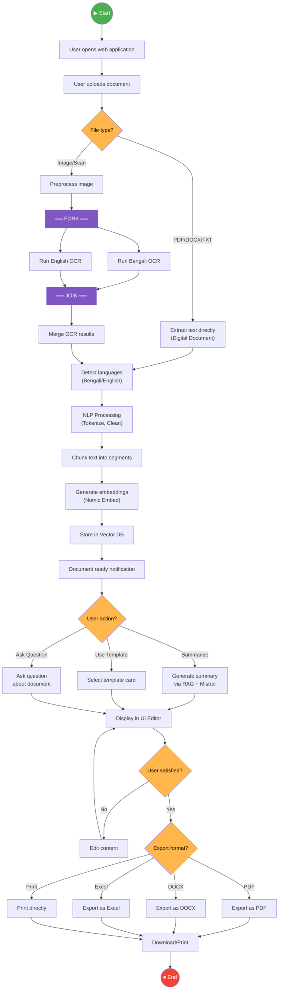
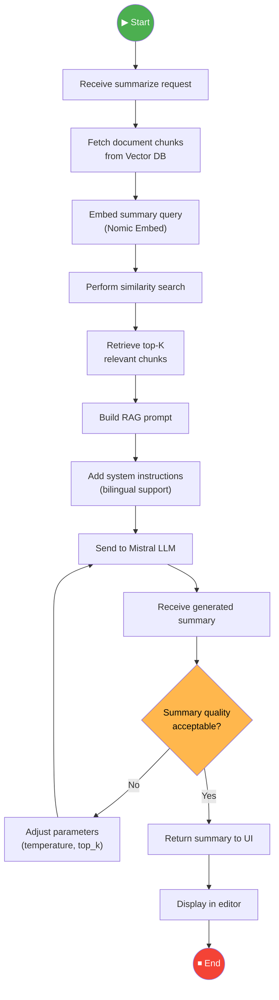
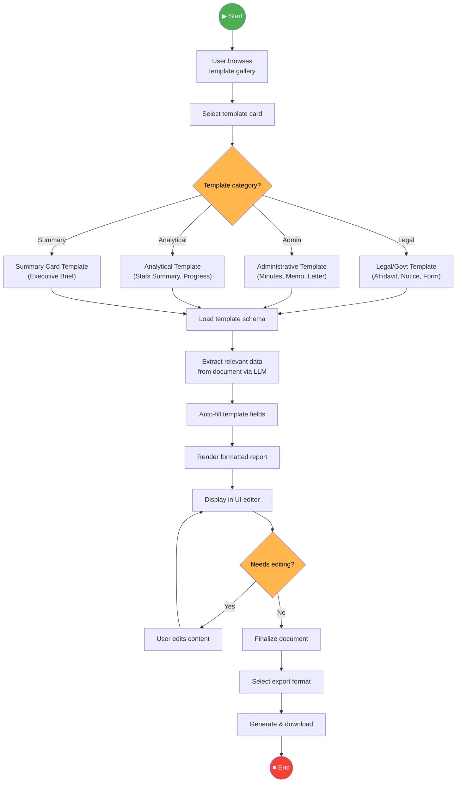

# 5. Activity Diagram

## Mermaid Files

| File                                                             | Description                           |
| ---------------------------------------------------------------- | ------------------------------------- |
| [activity_main_workflow.mmd](activity_main_workflow.mmd)         | Complete Document Processing Workflow |
| [activity_rag_summarization.mmd](activity_rag_summarization.mmd) | RAG-Based Summarization Process       |
| [activity_template_report.mmd](activity_template_report.mmd)     | Template-Based Report Generation      |

> Open `.mmd` files in [Mermaid Live Editor](https://mermaid.live), VS Code with Mermaid extension, or any Mermaid-compatible tool.

---

## What is an Activity Diagram?

An **Activity Diagram** is a UML diagram that models the **workflow or process flow** of the system. It shows the **step-by-step activities**, **decision points**, **parallel processes**, and **flow of control** from start to finish. Think of it as a more powerful version of a flowchart with support for concurrency.

## Why Use It?

- Models **complex business logic** with branching and parallelism
- Shows **decision points** and **conditional paths**
- Illustrates **parallel activities** using fork/join bars
- Maps directly to **user workflows**
- Great for **process documentation**

## When to Use

- During **workflow design**
- When modeling **business processes**
- For showing **parallel processing** paths
- In **system behavior documentation**

---

## Activity 1: Complete Document Processing Workflow

---

## Activity 2: RAG-Based Summarization Process

---

## Activity 3: Template-Based Report Generation

---

## Activity Diagram Notation

| Symbol            | Name            | Purpose               |
| ----------------- | --------------- | --------------------- |
| ● (Filled circle) | Initial Node    | Start of workflow     |
| ◉ (Circled dot)   | Final Node      | End of workflow       |
| ▭ (Rounded rect)  | Activity/Action | A step in the process |
| ◇ (Diamond)       | Decision        | Branching point       |
| ═══ (Thick bar)   | Fork/Join       | Parallel paths        |
| → (Arrow)         | Control Flow    | Direction of process  |
