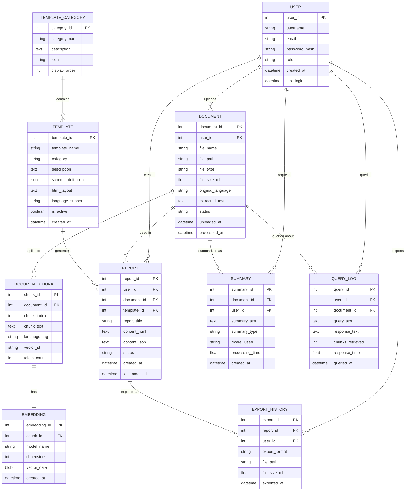

# 7. ER Diagram (Entity-Relationship Diagram)

## Mermaid Files

| File                             | Description                          |
| -------------------------------- | ------------------------------------ |
| [er_diagram.mmd](er_diagram.mmd) | Complete Entity-Relationship Diagram |

> Open `.mmd` files in [Mermaid Live Editor](https://mermaid.live), VS Code with Mermaid extension, or any Mermaid-compatible tool.

---

## What is an ER Diagram?

An **Entity-Relationship (ER) Diagram** shows the **data entities** in the system, their **attributes**, and the **relationships** between them. It is the foundation for **database design** and shows how data is structured and connected.

## Why Use It?

- Defines the **data model** of the system
- Shows **entities, attributes, and relationships**
- Foundation for **database schema design**
- Identifies **primary keys, foreign keys, cardinality**
- Required for **any data-driven application**

## When to Use

- During **database design phase**
- When planning **data storage structure**
- For **normalizing** data models
- In **project documentation and reports**

---

## Complete ER Diagram



---

## Entity Descriptions

| Entity                | Description                      | Records           |
| --------------------- | -------------------------------- | ----------------- |
| **USER**              | System users (officials, admins) | Hundreds          |
| **DOCUMENT**          | Uploaded bilingual documents     | Thousands         |
| **DOCUMENT_CHUNK**    | Text segments for RAG            | Tens of thousands |
| **EMBEDDING**         | Vector representations           | Tens of thousands |
| **TEMPLATE**          | Pre-defined card templates       | 10-15             |
| **REPORT**            | Generated formatted reports      | Thousands         |
| **SUMMARY**           | AI-generated summaries           | Thousands         |
| **EXPORT_HISTORY**    | Export audit trail               | Thousands         |
| **QUERY_LOG**         | User question history            | Thousands         |
| **TEMPLATE_CATEGORY** | Template groupings               | 4-5               |

---

## Relationship Summary

| Relationship        | Type | Description                              |
| ------------------- | ---- | ---------------------------------------- |
| User → Document     | 1:N  | One user uploads many documents          |
| Document → Chunk    | 1:N  | One document splits into many chunks     |
| Chunk → Embedding   | 1:1  | Each chunk has one embedding vector      |
| Template → Report   | 1:N  | One template generates many reports      |
| Category → Template | 1:N  | One category has many templates          |
| Document → Summary  | 1:N  | One document can have multiple summaries |
| Report → Export     | 1:N  | One report exported in multiple formats  |

---

## Template Categories (Pre-defined)

| Category ID | Name             | Templates                                                 |
| ----------- | ---------------- | --------------------------------------------------------- |
| 1           | Legal/Government | Affidavit, Notice, Application Form, Court Order          |
| 2           | Administrative   | Meeting Minutes, Internal Memo, Official Letter, Circular |
| 3           | Analytical       | Statistical Summary, Progress Report, Budget Report       |
| 4           | Summary Cards    | Executive Brief, Highlight Card, Quick Summary            |

---

## SQL Schema Preview

```sql
CREATE TABLE users (
    user_id INTEGER PRIMARY KEY AUTOINCREMENT,
    username VARCHAR(100) NOT NULL UNIQUE,
    email VARCHAR(255) NOT NULL UNIQUE,
    password_hash VARCHAR(255) NOT NULL,
    role VARCHAR(20) DEFAULT 'user',
    created_at TIMESTAMP DEFAULT CURRENT_TIMESTAMP
);

CREATE TABLE documents (
    document_id INTEGER PRIMARY KEY AUTOINCREMENT,
    user_id INTEGER REFERENCES users(user_id),
    file_name VARCHAR(255) NOT NULL,
    file_path TEXT NOT NULL,
    file_type VARCHAR(20),
    extracted_text TEXT,
    status VARCHAR(20) DEFAULT 'pending',
    uploaded_at TIMESTAMP DEFAULT CURRENT_TIMESTAMP
);

CREATE TABLE document_chunks (
    chunk_id INTEGER PRIMARY KEY AUTOINCREMENT,
    document_id INTEGER REFERENCES documents(document_id),
    chunk_index INTEGER,
    chunk_text TEXT NOT NULL,
    language_tag VARCHAR(10),
    vector_id VARCHAR(100)
);

CREATE TABLE templates (
    template_id INTEGER PRIMARY KEY AUTOINCREMENT,
    template_name VARCHAR(200) NOT NULL,
    category VARCHAR(50),
    schema_definition JSON,
    html_layout TEXT,
    is_active BOOLEAN DEFAULT TRUE
);
```
