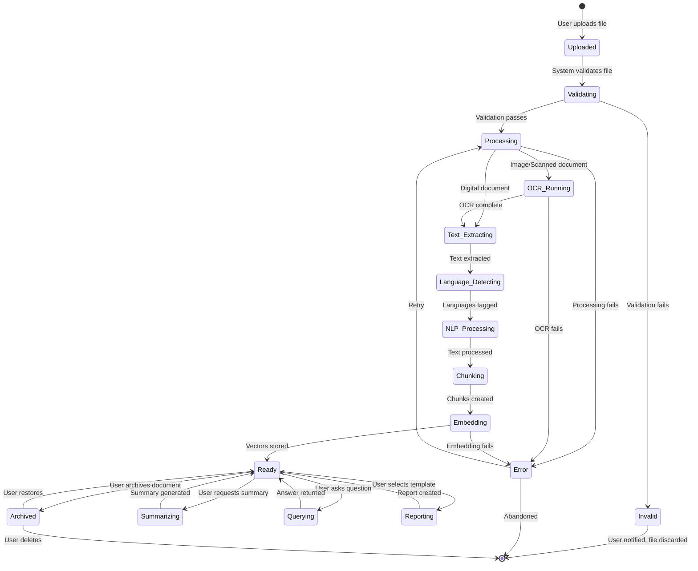
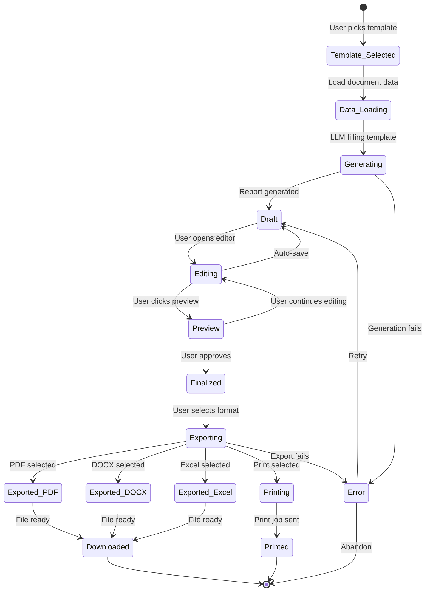
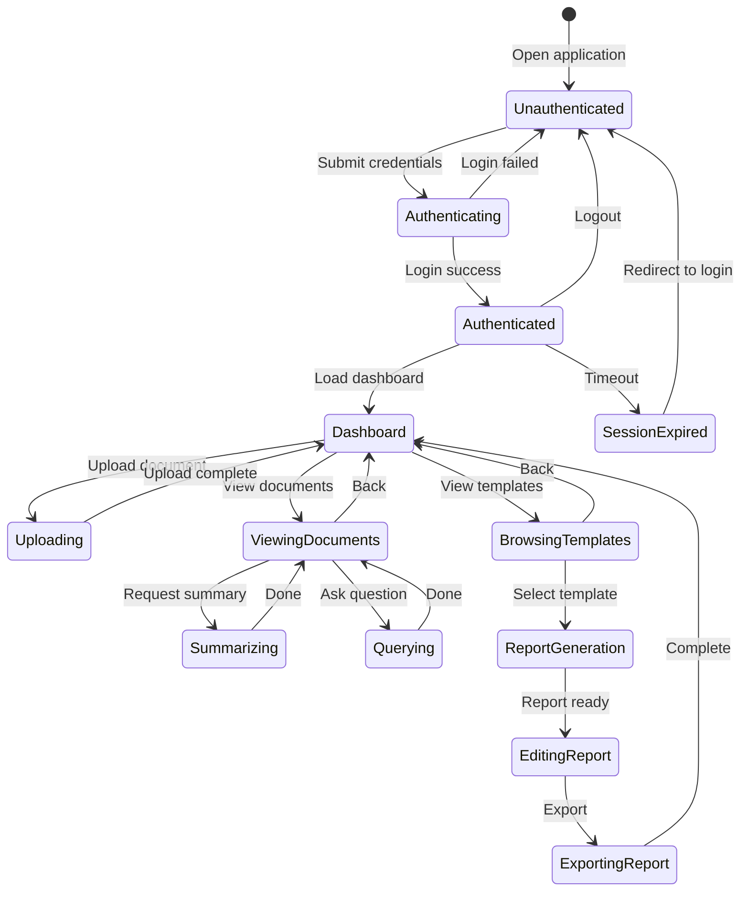

# 8. State Diagram

## Mermaid Files

| File                                                         | Description               |
| ------------------------------------------------------------ | ------------------------- |
| [state_document_lifecycle.mmd](state_document_lifecycle.mmd) | Document Lifecycle States |
| [state_report_lifecycle.mmd](state_report_lifecycle.mmd)     | Report Lifecycle States   |
| [state_user_session.mmd](state_user_session.mmd)             | User Session States       |

> Open `.mmd` files in [Mermaid Live Editor](https://mermaid.live), VS Code with Mermaid extension, or any Mermaid-compatible tool.

---

## What is a State Diagram?

A **State Diagram** (also called State Machine Diagram) shows the **different states** an object or entity can be in throughout its lifecycle, and the **transitions (events)** that cause it to move from one state to another. It answers: _"What stages does this entity go through?"_

## Why Use It?

- Models **lifecycle of key entities** (Document, Report, etc.)
- Shows **valid state transitions** and their triggers
- Helps in **error handling** and **edge case identification**
- Ensures all **states are accounted for** in the implementation
- Useful for **status tracking** in UI/UX design

## When to Use

- When entities have **multiple states** (e.g., document: uploaded → processing → ready)
- For **workflow management** features
- When designing **status indicators** in UI
- During **business logic validation**

---

## State Diagram 1: Document Lifecycle

---

## State Diagram 2: Report Lifecycle

---

## State Diagram 3: User Session States

---

## State Transition Table: Document

| Current State      | Event/Trigger     | Next State         | Action                    |
| ------------------ | ----------------- | ------------------ | ------------------------- |
| —                  | Upload file       | Uploaded           | Save file to storage      |
| Uploaded           | Validate          | Validating         | Check file type, size     |
| Validating         | Valid             | Processing         | Begin processing pipeline |
| Validating         | Invalid           | Invalid            | Show error message        |
| Processing         | Image detected    | OCR_Running        | Start OCR engine          |
| Processing         | Text file         | Text_Extracting    | Direct text extraction    |
| OCR_Running        | OCR complete      | Text_Extracting    | Merge OCR results         |
| Text_Extracting    | Done              | Language_Detecting | Detect Bengali/English    |
| Language_Detecting | Tagged            | NLP_Processing     | Apply NLP pipeline        |
| NLP_Processing     | Processed         | Chunking           | Split into segments       |
| Chunking           | Chunked           | Embedding          | Generate vectors          |
| Embedding          | Stored            | Ready              | Document available        |
| Ready              | Summarize request | Summarizing        | Run RAG + Mistral         |
| Ready              | Template select   | Reporting          | Generate report           |
| Ready              | Archive           | Archived           | Move to archive           |
| Error              | Retry             | Processing         | Restart pipeline          |

---

## State Color Legend

| Color       | Meaning                 |
| ----------- | ----------------------- |
| Default     | Normal processing state |
| Start (●)   | Initial state           |
| End (◉)     | Terminal state          |
| Error paths | Failure recovery flows  |
