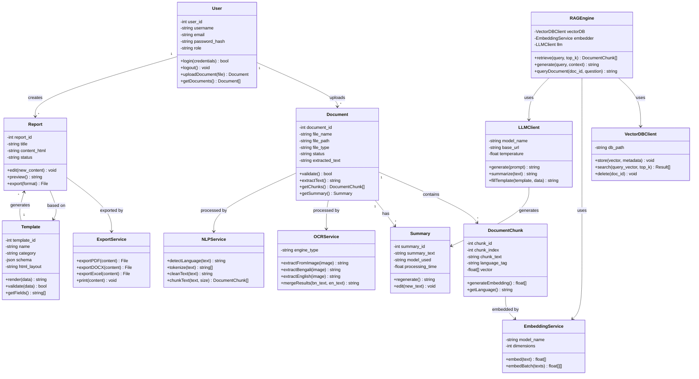

# 11. Class Diagram (Bonus)

## Mermaid Files

| File                                   | Description                                           |
| -------------------------------------- | ----------------------------------------------------- |
| [class_diagram.mmd](class_diagram.mmd) | Core Classes with attributes, methods & relationships |

> Open `.mmd` files in [Mermaid Live Editor](https://mermaid.live), VS Code with Mermaid extension, or any Mermaid-compatible tool.

---

## What is a Class Diagram?

A **Class Diagram** is a UML structural diagram that shows the **classes** in the system, their **attributes**, **methods**, and the **relationships** between them (inheritance, composition, association). It is the blueprint for **object-oriented design**.

## Why Use It?

- Defines **object-oriented structure** of the codebase
- Shows **inheritance and composition** relationships
- Identifies **methods and attributes** per class
- Foundation for **code implementation**
- Commonly required in **software engineering courses**

## When to Use

- During **detailed design phase**
- When planning **class hierarchy** and **code structure**
- For **API and service layer design**
- In **project documentation** for developers

---

## Core Classes Diagram

---

## Relationship Types

| Relationship     | Symbol | Example                              |
| ---------------- | ------ | ------------------------------------ |
| **Association**  | →      | User → Document (uploads)            |
| **Composition**  | ◆→     | Document ◆→ DocumentChunk (contains) |
| **Dependency**   | ..>    | RAGEngine ..> LLMClient (uses)       |
| **Inheritance**  | ▷      | PDFExporter ▷ ExportService          |
| **Multiplicity** | 1..\*  | One User has many Documents          |

---

## Design Patterns Used

| Pattern        | Where Applied                  | Purpose                                   |
| -------------- | ------------------------------ | ----------------------------------------- |
| **Strategy**   | ExportService (PDF/DOCX/Excel) | Swap export formats dynamically           |
| **Factory**    | TemplateEngine                 | Create different template types           |
| **Facade**     | RAGEngine                      | Simplified interface to complex subsystem |
| **Repository** | VectorDBClient                 | Abstract data access layer                |
| **Observer**   | Document status changes        | Notify UI of processing updates           |
| **Singleton**  | LLMClient (Ollama connection)  | Single connection instance                |
