# 13 — System Flowcharts

All diagrams use Mermaid syntax. Render in any Mermaid-compatible viewer (GitHub, VS Code extension, mermaid.live).

---

## 1. Master Pipeline Flow

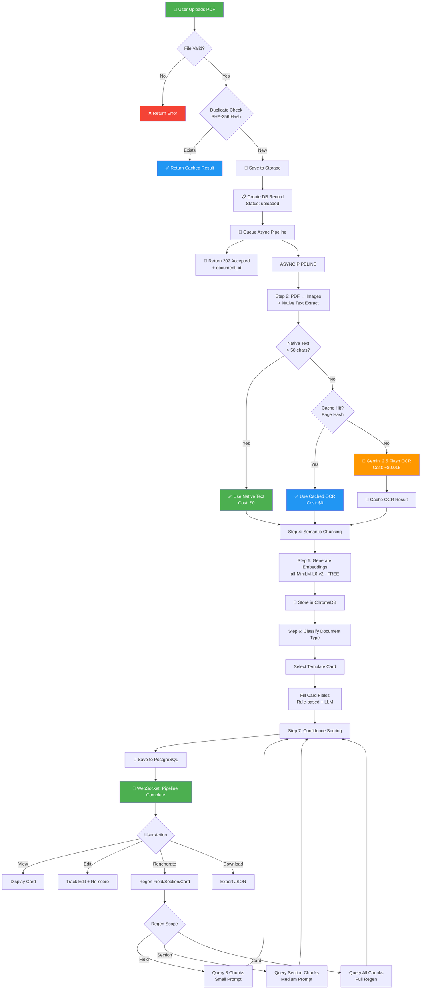

---

## 2. OCR Decision Tree

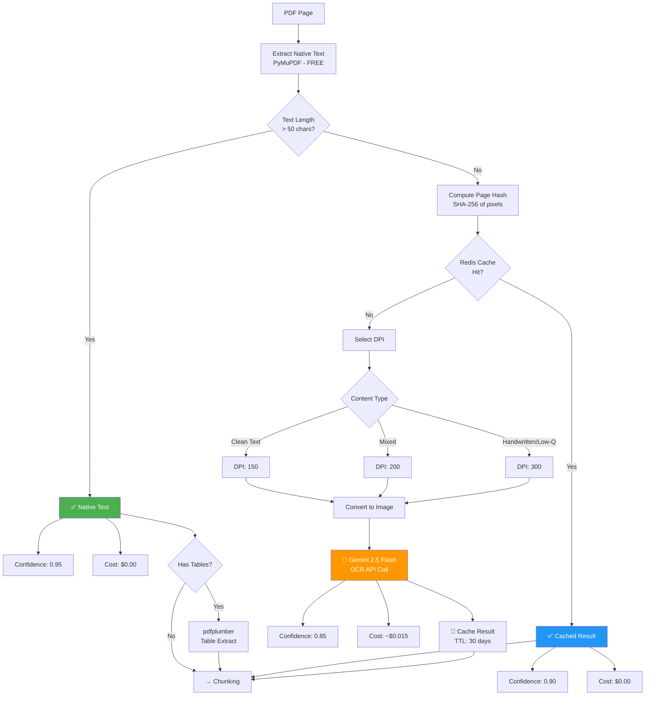

---

## 3. Chunking Pipeline

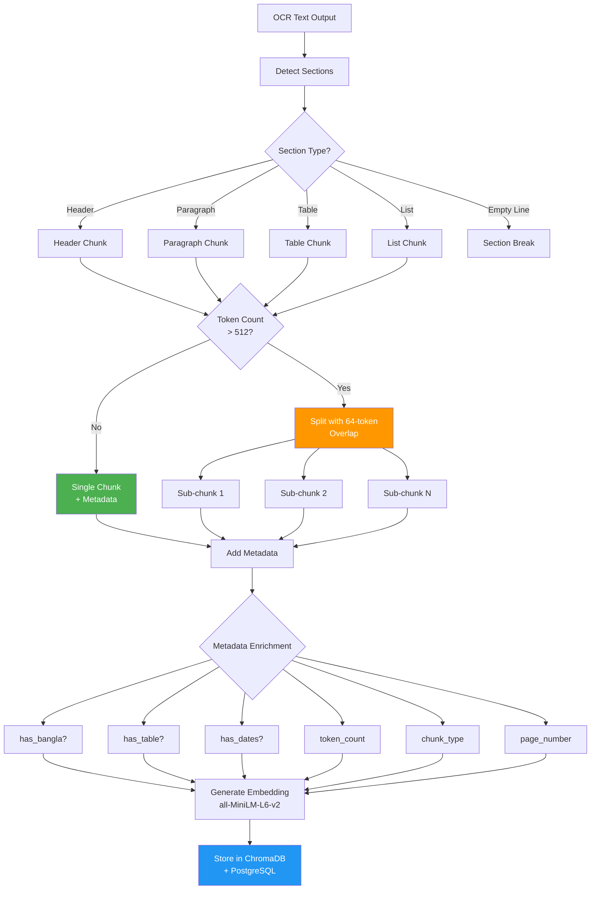

---

## 4. Template Card Generation Flow

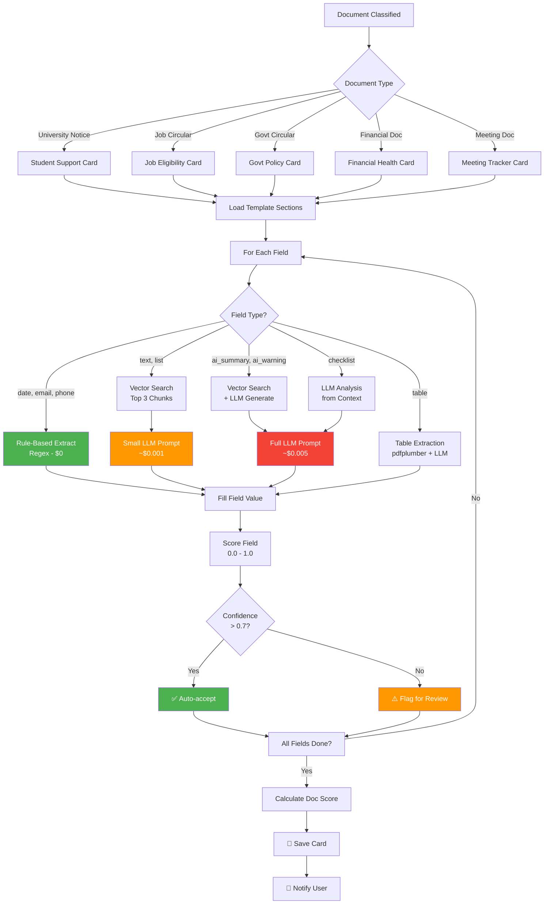

---

## 5. Regeneration Workflow

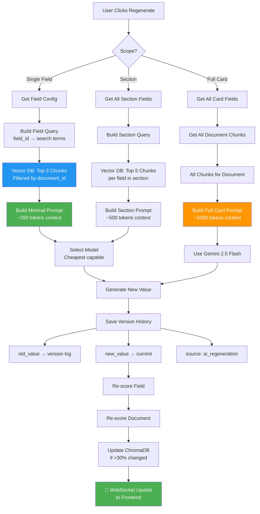

---

## 6. Confidence Scoring Flow

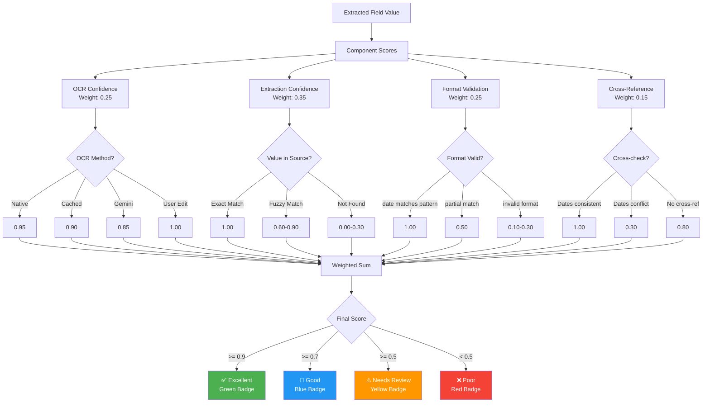

---

## 7. Caching Architecture

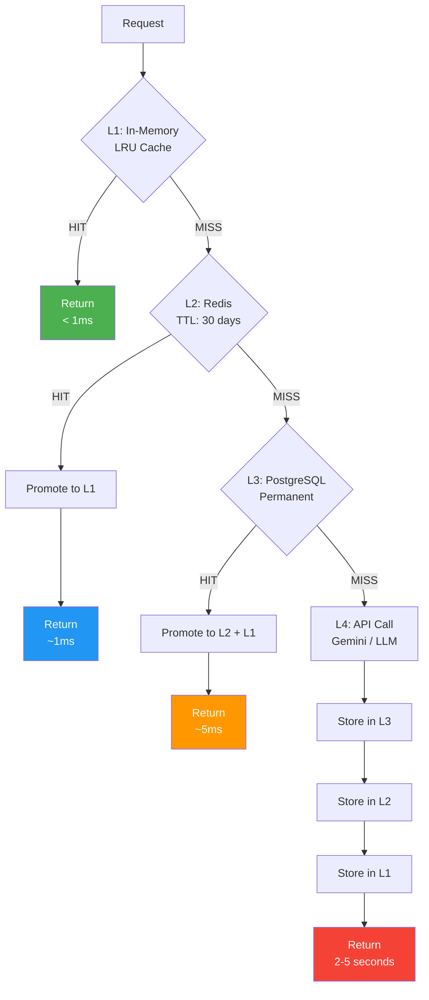

---

## 8. User Edit & Version Tracking

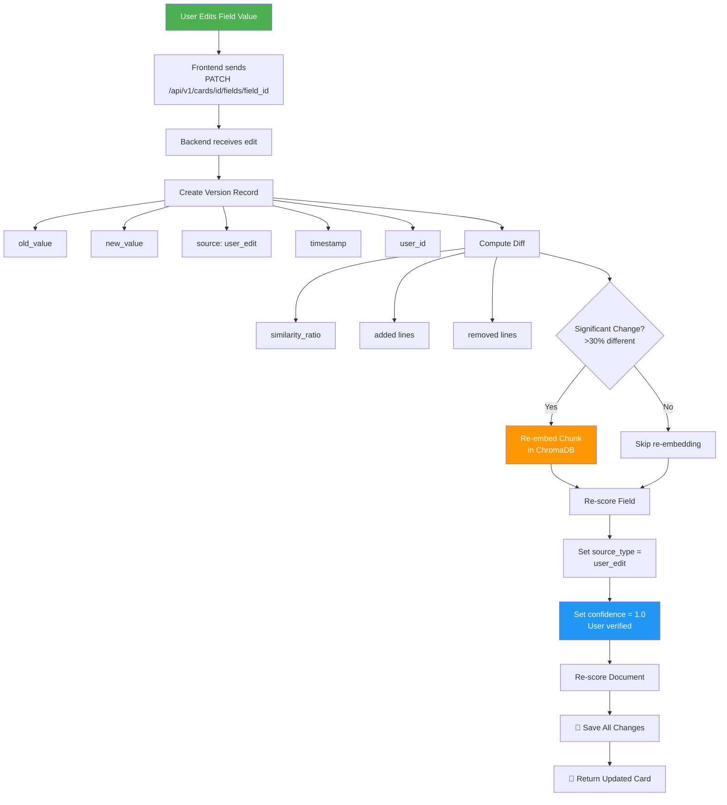

---

## 9. Model Routing Decision

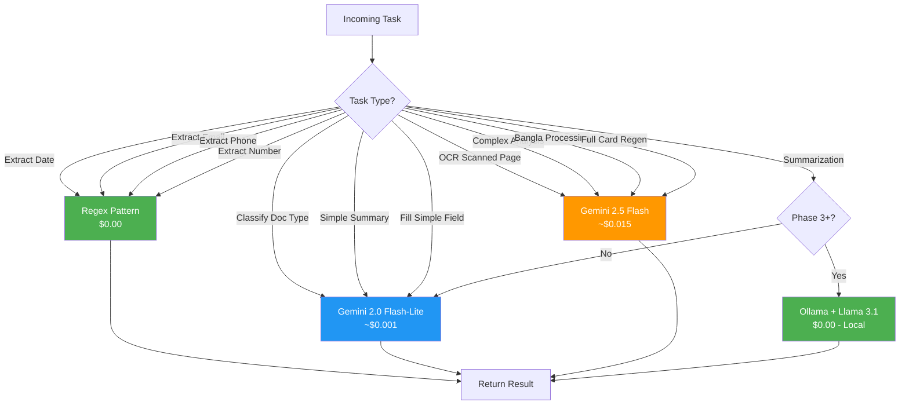

---

## 10. Deployment Architecture

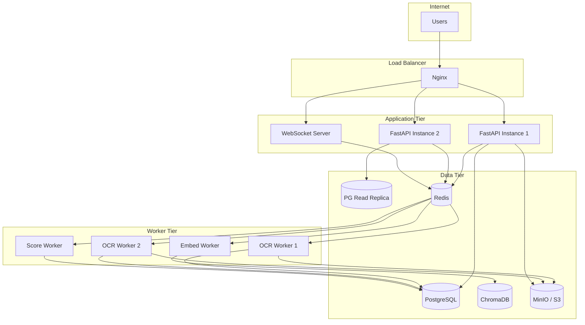

---

## 11. Database Entity Relationship

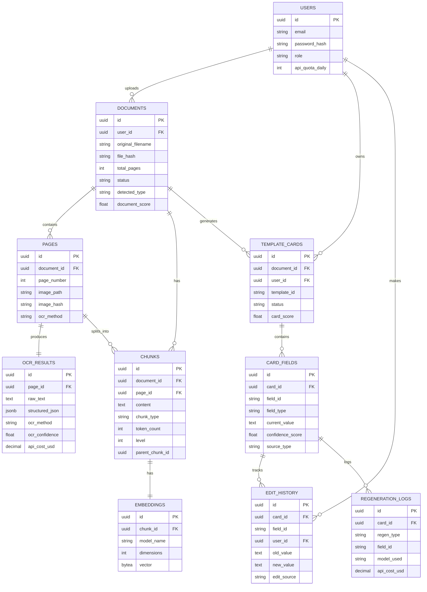

---

## How to Render These Diagrams

1. **VS Code:** Install "Markdown Preview Mermaid Support" extension
2. **GitHub:** Mermaid renders natively in `.md` files
3. **Online:** Paste code at [mermaid.live](https://mermaid.live)
4. **Export as PNG:** Use mermaid CLI: `npx @mermaid-js/mermaid-cli mmdc -i input.md -o output.png`
