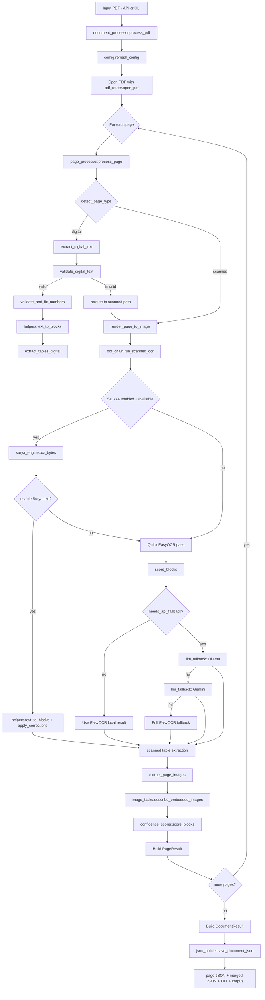
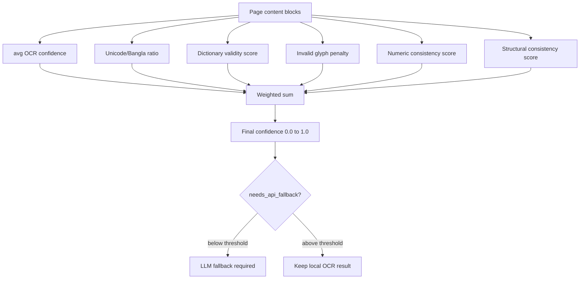
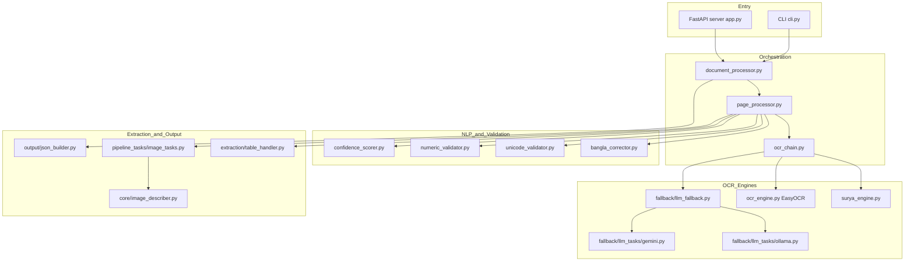
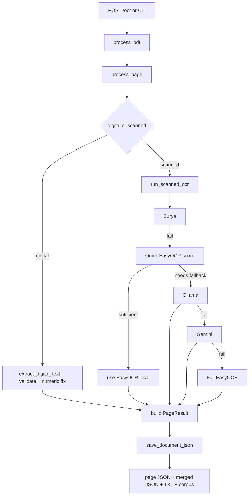

BanglaDOC Surya Clean
=====================

Production-oriented OCR pipeline for Bangla-heavy PDFs with deterministic local OCR, confidence-aware LLM fallback, and structured corpus export.

This project is built for scanned and mixed PDFs where script quality varies across pages. It prioritizes correctness, traceability, and debuggable pipeline stages over hidden "magic" behavior.

## Core Capabilities

- Surya-first OCR path for scanned Bangla pages.
- Confidence-aware gating to skip expensive LLM fallback when local OCR is already good.
- Fallback chain: Ollama -> Gemini -> EasyOCR.
- Page-level table extraction for both digital and scanned pages.
- Engine-tagged output artifacts (`_surya`, `_ollama`, `_gemini`, `_easyocr`, `_digital`, `_mixed`).
- Corpus export (`parquet` with JSONL fallback) plus aggregated corpus stats.
- FastAPI server, browser UI, and CLI entrypoint using the same core pipeline.

## End-to-End Flow

### 1) Entry points

- HTTP: `backend/bangladoc_ocr/server/app.py`
  - `POST /ocr` accepts PDF uploads and triggers processing.
  - `GET /ocr/progress` returns progress state.
  - `GET /corpus/stats` and `GET /corpus/export` expose corpus outputs.
  - `POST /corpus/verify` toggles page verification flags and rebuilds corpus stats.
- CLI: `backend/bangladoc_ocr/cli.py`
  - Runs the same document pipeline for one or more PDF files.

### 2) Document orchestration

`process_pdf()` in `backend/bangladoc_ocr/pipeline_tasks/document_processor.py`:

1. Reloads runtime config from `.env`.
2. Optionally warms Surya (when enabled).
3. Opens the PDF and iterates pages.
4. Calls `process_page()` for each page.
5. Builds final `DocumentResult` metadata.
6. Persists per-page JSON, merged JSON, TXT, and corpus rows.

### 3) Per-page processing

`process_page()` in `backend/bangladoc_ocr/pipeline_tasks/page_processor.py`:

1. Detects page type (`digital` or `scanned`).
2. Digital page path:
   - Extract text via PyMuPDF.
   - Validate Unicode/script consistency.
   - Apply numeric normalization.
   - Build content blocks and digital tables.
3. Scanned page path:
   - Render page to image.
   - Run scanned OCR chain (`run_scanned_ocr`).
   - Convert OCR blocks to detection tuples and extract scanned tables.
4. Extract embedded page images and generate short descriptions.
5. Compute confidence score and finalize page decisions.

### 4) Scanned OCR chain

`run_scanned_ocr()` in `backend/bangladoc_ocr/pipeline_tasks/ocr_chain.py`:

1. Try Surya first (if enabled and available).
2. If Surya does not produce a valid result:
   - Run fast EasyOCR quick pass.
   - Score confidence and decide `needs_api_fallback(...)`.
   - If local quality is sufficient, skip LLM and return EasyOCR output.
3. If fallback is needed:
   - Try Ollama first.
   - If Ollama fails, try Gemini.
4. If all LLM fallback fails:
   - Run full EasyOCR fallback as final local safety net.

### 5) NLP correction and scoring

- `bangla_corrector.py` applies Bangla-aware cleanup and correction.
- `unicode_validator.py` handles script hygiene and suspicious line stripping.
- `confidence_scorer.py` computes language-aware confidence and fallback thresholds.

### 6) Output writing

`backend/bangladoc_ocr/output/json_builder.py`:

- Ensures output directories exist.
- Writes per-page JSON files with engine suffix.
- Writes merged document JSON with `document.output_engine_tag`.
- Writes extracted TXT with engine suffix.
- Appends corpus rows and updates corpus stats.

## Project Structure Diagram

```text
bangladoc_surya_clean/
├── README.md
├── cmd.txt
├── docker-compose.yml
├── data/                              # runtime outputs (gitignored in normal flow)
│   ├── output_images/
│   ├── output_jsons/
│   ├── merged_outputs/
│   ├── output_texts/
│   └── corpus/
└── backend/
    ├── .env
    ├── .env.example
    ├── pyproject.toml
    └── bangladoc_ocr/
        ├── __init__.py
        ├── cli.py
        ├── config.py
        ├── exceptions.py
        ├── models.py
        ├── pipeline.py
        ├── assets/
        │   ├── bangla_wordlist.txt
        │   └── prompts/
        │       ├── ocr_prompt.txt
        │       └── ollama_prompt.txt
        ├── core/
        │   ├── pdf_router.py
        │   ├── ocr_engine.py
        │   ├── surya_engine.py
        │   └── image_describer.py
        ├── pipeline_tasks/
        │   ├── document_processor.py
        │   ├── page_processor.py
        │   ├── ocr_chain.py
        │   ├── helpers.py
        │   └── image_tasks.py
        ├── extraction/
        │   └── table_handler.py
        ├── nlp/
        │   ├── bangla_corrector.py
        │   ├── confidence_scorer.py
        │   ├── numeric_validator.py
        │   └── unicode_validator.py
        ├── fallback/
        │   ├── llm_fallback.py
        │   └── llm_tasks/
        │       ├── gemini.py
        │       ├── ollama.py
        │       ├── parser.py
        │       ├── prompts.py
        │       └── state.py
        ├── output/
        │   └── json_builder.py
        ├── server/
        │   └── app.py
        ├── static/
        │   └── index.html
        └── tests/
            ├── test_bangla_corrector.py
            ├── test_confidence_scorer.py
            ├── test_numeric_validator.py
            └── test_unicode_validator.py
```

## Pipeline Methodology

### OCR decision strategy

- Use local OCR whenever quality is adequate.
- Use LLM fallback only when confidence thresholds indicate it is necessary.
- Keep a strict chain order so behavior remains deterministic and explainable.

### Script robustness strategy

- Detect and remove Devanagari-dominant contaminated lines from Surya output.
- Reject Surya output only after cleanup if still script-mismatched or too short.

### Output traceability strategy

- Every output is tagged by final extraction engine.
- Mixed-engine multi-page documents are explicitly marked `_mixed`.
- Page decisions are captured in logs/decision arrays for debugging.

## Full Process Diagram (Step-by-step)



## NLP and Correction Pipeline Diagram


### What each NLP module does

- `bangla_corrector.py`: applies Bangla-aware text cleanup and correction (word validity, common OCR artifacts, script-sensitive fixes).
- `unicode_validator.py`: measures Bangla/script ratios, strips Devanagari-dominant noise lines, and removes non-printable/control artifacts in output serialization.
- `numeric_validator.py`: repairs OCR-number confusions and validates numeric consistency (digital path).
- `confidence_scorer.py`: computes weighted confidence and decides if API fallback is needed.

## Confidence Scoring Diagram



### How score is valued

- The scorer uses different weight profiles for Bangla-heavy vs English-heavy pages.
- Threshold decision:
  - Bangla-heavy uses `API_FALLBACK_THRESHOLD_BANGLA`.
  - Non-Bangla-heavy uses `API_FALLBACK_THRESHOLD_ENGLISH`.
- If confidence is below threshold, API fallback is attempted; otherwise local OCR is accepted.

## Architecture Pipeline Diagram



## Runtime Configuration

Configured in `backend/.env` (template: `backend/.env.example`).

Most important controls:

- `SURYA_ENABLED=true|false`
  - `true`: Surya-first scanned flow.
  - `false`: skip Surya and begin from local/LLM chain.
- `DATA_DIR=...`
  - Relative paths are resolved from project root (`bangladoc_surya_clean`).
- `GEMINI_ENABLED`, `GEMINI_API_KEY`
  - Enables Gemini fallback when Ollama fails.
- `OLLAMA_BASE_URL`, `OLLAMA_IMAGE_MODEL`
  - Controls local Ollama fallback and image description model.
- `DPI`, `MAX_WORKERS`, threshold values
  - Controls rendering/throughput/scoring behavior.

## Output Structure

Assuming `DATA_DIR=../data`, the generated artifacts are:

- `data/output_images/<doc_id>/`
  - Rendered page images and extracted embedded images.
- `data/output_jsons/<doc_id>/page_<n>_<engine>.json`
  - Page-level structured output.
- `data/merged_outputs/<doc_id>_<engine-or-mixed>.json`
  - Full document output.
- `data/output_texts/<doc_id>_<engine-or-mixed>.txt`
  - Plain text export grouped by page.
- `data/corpus/corpus.parquet` (or `corpus.jsonl` fallback)
  - Row-wise corpus data for analysis/training.
- `data/corpus/corpus_stats.json`
  - Aggregated corpus metrics (by domain/tier/engine).

## Internal Call Graph



## Professional File Structure Guide

### Repository root

| Path | Responsibility |
|---|---|
| `.gitignore` | Ignores runtime artifacts, caches, venvs, local secrets. |
| `README.md` | This technical and operational documentation. |
| `cmd.txt` | Practical setup/run command cookbook. |
| `docker-compose.yml` | Containerized deployment/dev orchestration. |
| `backend/` | Python package, API server, OCR engines, pipeline, tests. |
| `data/` | Runtime-generated artifacts (usually ignored by git). |

### `backend/`

| Path | Responsibility |
|---|---|
| `pyproject.toml` | Package metadata, dependencies, extras, entry points. |
| `.env.example` | Environment template with safe defaults. |
| `.env` | Local runtime secrets and toggles (not committed). |
| `bangladoc_ocr/` | Main OCR application package. |

### `backend/bangladoc_ocr/`

| Path | Responsibility |
|---|---|
| `__init__.py` | Package marker. |
| `cli.py` | Command-line entrypoint, shared pipeline invocation. |
| `config.py` | Environment loading, dynamic config refresh, path setup. |
| `exceptions.py` | Domain-specific exceptions for OCR and fallback errors. |
| `models.py` | Dataclasses for page/document/schema exchange between stages. |
| `pipeline.py` | Compatibility export for `process_pdf`. |

### `backend/bangladoc_ocr/core/`

| Path | Responsibility |
|---|---|
| `pdf_router.py` | PDF/page utilities: classification, rendering, extraction. |
| `ocr_engine.py` | Local OCR calls (EasyOCR), detections-to-block conversion. |
| `surya_engine.py` | Surya model lifecycle, thread-safe loading, OCR call wrapper. |
| `image_describer.py` | Async image caption fallback (Ollama then Gemini). |

### `backend/bangladoc_ocr/pipeline_tasks/`

| Path | Responsibility |
|---|---|
| `document_processor.py` | Full document loop and result aggregation. |
| `page_processor.py` | Digital/scanned branching and page-level assembly. |
| `ocr_chain.py` | Scanned OCR decision chain and fallback gating. |
| `helpers.py` | Shared block conversion, corrections, language helper logic. |
| `image_tasks.py` | Embedded image persistence and safe async description calls. |

### `backend/bangladoc_ocr/fallback/`

| Path | Responsibility |
|---|---|
| `llm_fallback.py` | Orchestrates Ollama/Gemini sequence and exposes stats. |
| `llm_tasks/ollama.py` | Ollama availability, request execution, model selection. |
| `llm_tasks/gemini.py` | Gemini API OCR fallback with retry rules. |
| `llm_tasks/parser.py` | LLM text-to-block parsing helpers. |
| `llm_tasks/prompts.py` | Prompt loading and normalization utilities. |
| `llm_tasks/state.py` | Shared fallback counters/status with lock-safe updates. |

### `backend/bangladoc_ocr/nlp/`

| Path | Responsibility |
|---|---|
| `bangla_corrector.py` | Bangla spelling/cleanup/correction pipeline. |
| `confidence_scorer.py` | Confidence scoring and fallback threshold decisions. |
| `numeric_validator.py` | Numeric consistency checks and correction. |
| `unicode_validator.py` | Script ratio checks, text cleaning, contamination stripping. |

### `backend/bangladoc_ocr/extraction/`

| Path | Responsibility |
|---|---|
| `table_handler.py` | Digital and scanned table extraction and normalization. |

### `backend/bangladoc_ocr/output/`

| Path | Responsibility |
|---|---|
| `json_builder.py` | Output persistence, compatibility loading, corpus exports/stats. |

### `backend/bangladoc_ocr/server/`

| Path | Responsibility |
|---|---|
| `app.py` | FastAPI app, routes, progress tracking, warmup, response shaping. |

### `backend/bangladoc_ocr/static/`

| Path | Responsibility |
|---|---|
| `index.html` | Upload UI and result inspection frontend. |

### `backend/bangladoc_ocr/tests/`

| Path | Responsibility |
|---|---|
| `test_bangla_corrector.py` | Corrector behavior tests. |
| `test_confidence_scorer.py` | Confidence and fallback rule tests. |
| `test_numeric_validator.py` | Numeric validator tests. |
| `test_unicode_validator.py` | Unicode/script validator tests. |

## API Contract Summary

- `GET /health` - service liveness.
- `GET /stats` - fallback engine stats.
- `GET /ocr/progress` - current OCR progress.
- `POST /ocr` - process uploaded PDFs.
- `GET /corpus/stats` - corpus aggregate statistics.
- `GET /corpus/export` - download corpus parquet.
- `POST /corpus/verify` - set verification flag for a page.

## Troubleshooting

### 1) No outputs are being saved where expected

- Symptom: OCR succeeds but files are not found in your expected folder.
- Check: `DATA_DIR` in `backend/.env`.
- Behavior: relative `DATA_DIR` is resolved from project root (`bangladoc_surya_clean`), not shell cwd.
- Fix: set an absolute path or correct relative path, then run OCR again.

### 2) Surya is enabled but not used

- Symptom: logs show Surya unavailable or pipeline skips to fallback.
- Check:
  - `SURYA_ENABLED=true` in `backend/.env`.
  - model dependencies are installed in the active environment.
- Runtime behavior: if Surya load fails, chain continues with fallback OCR by design.
- Fix: resolve environment/model install issue, then restart server for clean warmup.

### 3) Ollama fallback not running

- Symptom: fallback skips Ollama and goes to Gemini/EasyOCR.
- Check:
  - Ollama daemon is running.
  - `OLLAMA_BASE_URL` is reachable.
  - a vision-capable model exists locally.
- Quick validation: hit `/stats` and inspect Ollama status/error fields.

### 4) Gemini fallback never runs

- Symptom: Gemini is always marked unavailable.
- Check:
  - `GEMINI_ENABLED=true`
  - `GEMINI_API_KEY` is present and valid.
- Behavior: if disabled or key missing, chain does not call Gemini.

### 5) LLM calls seem too frequent

- Symptom: higher-than-expected API usage.
- Behavior: quick EasyOCR confidence gate runs first; LLM is called only when `needs_api_fallback(...)` returns true.
- Check:
  - document quality and script noise.
  - fallback thresholds in `.env` (`API_FALLBACK_THRESHOLD_*`).

### 6) `/corpus/export` returns not found

- Symptom: API responds with 404 for corpus export.
- Cause: corpus parquet is generated only after at least one successful OCR run with outputs saved.
- Fix: run OCR once, then retry `/corpus/export`.

### 7) Verify endpoint cannot find page JSON

- Symptom: `POST /corpus/verify` returns page not found.
- Behavior: lookup supports both new `page_<n>_<engine>.json` and legacy `page_<n>.json`.
- Check:
  - correct `doc_id` and `page_number`.
  - page JSON exists under `data/output_jsons/<doc_id>/`.

### 8) `.env` changes do not seem applied

- Behavior: config is refreshed at processing start, so most toggles apply on next OCR request.
- Note: startup warmup still reflects server start state; restart server after major engine toggle changes for predictable warmup logs.

## Development and Operations

- For complete setup and commands, use `cmd.txt`.
- Run tests from `backend/`:
  - `./venv/bin/python -m pytest bangladoc_ocr/tests/ -q`
- Keep `backend/.env` local; do not commit secrets.

## Notes on Backward Compatibility

- Merged outputs now use engine suffix naming; loader supports legacy names.
- Per-page JSON lookup supports both new engine-suffixed and older `page_<n>.json` names.
- Config refresh is run per processing invocation to apply `.env` toggles safely.
