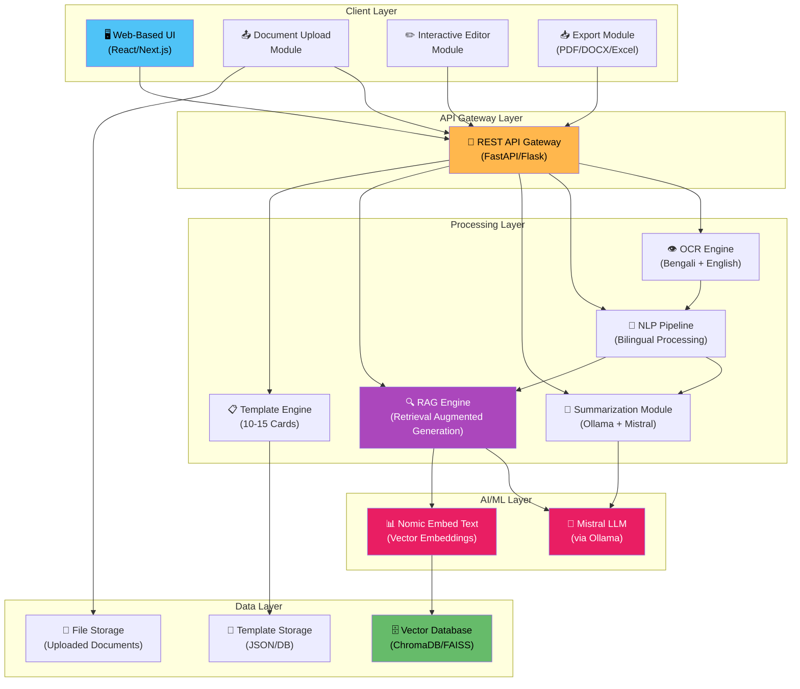

# 1. System Architecture Diagram

## Mermaid Files

| File | Description |
|------|-------------|
| [system_architecture.mmd](system_architecture.mmd) | Complete system architecture with all layers |

> Open `.mmd` files in [Mermaid Live Editor](https://mermaid.live), VS Code with Mermaid extension, or any Mermaid-compatible tool.

---

## What is a System Architecture Diagram?

A **System Architecture Diagram** provides a high-level overview of the entire system, showing the major components/modules and how they interact with each other. It is the **first diagram** you should present in any system project as it gives evaluators an immediate understanding of your system's structure.

## Why Use It?

- Shows the **big picture** of the system
- Identifies all major **modules and subsystems**
- Illustrates **communication paths** between components
- Helps stakeholders understand **technology stack**
- Essential for **system design documentation**

## When to Use

- At the **beginning** of project documentation
- During **system design phase**
- When presenting to **non-technical stakeholders**
- In **project proposals and reports**

---

## System Architecture for Multilingual Document Processing System

---

## Component Breakdown

| Layer | Component | Technology | Purpose |
|-------|-----------|------------|---------|
| Client | Web UI | React/Next.js | User interaction interface |
| Client | Upload Module | Dropzone.js | Document upload handling |
| Client | Editor | Draft.js/TipTap | Content editing before export |
| Client | Export | jsPDF, docx, xlsx | Multi-format file generation |
| API | Gateway | FastAPI/Flask | Request routing & authentication |
| Processing | OCR Engine | Tesseract/EasyOCR | Text extraction from documents |
| Processing | NLP Pipeline | spaCy/NLTK | Bilingual text processing |
| Processing | Summarizer | Ollama + Mistral | AI-powered summarization |
| Processing | RAG Engine | LangChain | Context-aware generation |
| Processing | Template Engine | Jinja2 | Template-based output formatting |
| AI/ML | Mistral LLM | Ollama (local) | Text generation & summarization |
| AI/ML | Nomic Embed | Ollama (local) | Document embeddings |
| Data | Vector DB | ChromaDB/FAISS | Similarity search storage |
| Data | File Storage | Local/S3 | Document file management |
| Data | Template DB | JSON/SQLite | Template definitions storage |

---

## How to Read This Diagram

1. **Top-Down Flow**: Users interact through the **Client Layer** at the top
2. **API Gateway**: All requests pass through a central API layer
3. **Processing**: The middle layer handles all business logic
4. **AI/ML**: The intelligence layer provides LLM and embedding capabilities
5. **Data**: The bottom layer manages all persistent storage

---

## Key Design Decisions

- **Local AI Models**: Using Ollama (Mistral + Nomic) keeps data private and avoids API costs
- **RAG Architecture**: Enables context-aware responses from uploaded documents
- **Template System**: Pre-defined cards allow quick, standardized document generation
- **Modular Design**: Each component can be independently developed and tested
