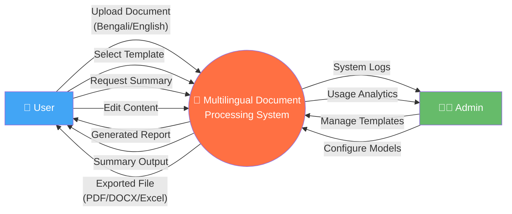
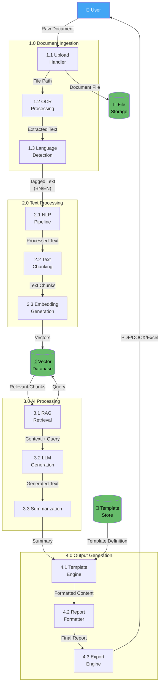
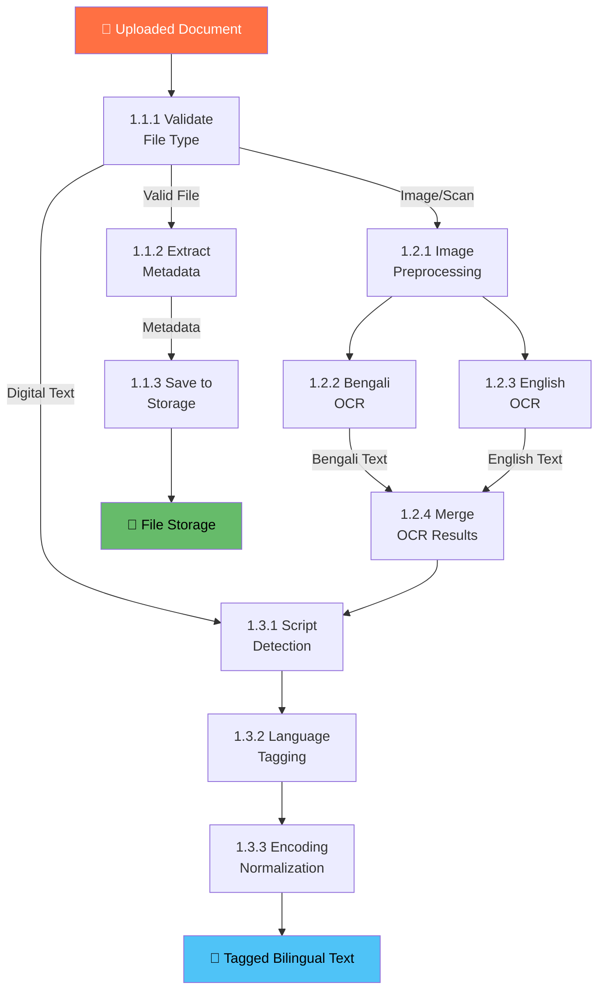

# 2. Data Flow Diagram (DFD)

## Mermaid Files

| File | Description |
|------|-------------|
| [dfd_level0_context.mmd](dfd_level0_context.mmd) | Level 0 — Context Diagram |
| [dfd_level1_processes.mmd](dfd_level1_processes.mmd) | Level 1 — Major Process Breakdown |
| [dfd_level2_ingestion.mmd](dfd_level2_ingestion.mmd) | Level 2 — Document Ingestion Detail |

> Open `.mmd` files in [Mermaid Live Editor](https://mermaid.live), VS Code with Mermaid extension, or any Mermaid-compatible tool.

---

## What is a Data Flow Diagram?

A **Data Flow Diagram (DFD)** shows how data moves through the system — from input sources, through processing stages, to outputs. It focuses on **what data flows where**, not on control logic or timing.

DFDs have multiple levels:
- **Level 0 (Context Diagram)**: Shows the system as a single process with external entities
- **Level 1**: Breaks the system into major sub-processes
- **Level 2**: Further decomposes each sub-process

## Why Use It?

- Visualizes the **flow of data** through the system
- Identifies **data sources and destinations**
- Shows **data transformations** at each stage
- Helps in **database design** and **API planning**
- Required in most **academic project reports**

## When to Use

- During **requirements analysis**
- When designing **data pipelines**
- For **documenting system processes**
- In **academic project submissions** (very commonly expected)

---

## Level 0 — Context Diagram

---

## Level 1 — Major Process Breakdown

---

## Level 2 — Document Ingestion (Process 1.0 Detailed)

---

## Data Dictionary

| Data Flow | Description | Format | Source → Destination |
|-----------|-------------|--------|---------------------|
| Raw Document | User uploaded file | PDF/Image/DOCX/TXT | User → Upload Handler |
| Extracted Text | OCR output text | UTF-8 String | OCR Engine → Language Detection |
| Tagged Text | Language-annotated text | JSON {text, lang} | Language Detection → NLP Pipeline |
| Text Chunks | Segmented text pieces | Array of strings | Text Chunking → Embedding |
| Vectors | Numerical embeddings | Float Array (768d) | Embedding → Vector DB |
| Relevant Chunks | Retrieved context | Array of strings | Vector DB → RAG |
| Generated Text | LLM output | UTF-8 String | LLM → Summarization |
| Template Definition | Card layout specs | JSON Schema | Template Store → Template Engine |
| Final Report | Formatted document | HTML/JSON | Report Formatter → Export Engine |
| Export File | Downloadable file | PDF/DOCX/XLSX | Export Engine → User |

---

## DFD Symbols Reference

| Symbol | Meaning | Example |
|--------|---------|---------|
| ▭ Rectangle | External Entity | User, Admin |
| ○ Circle/Rounded | Process | OCR Processing |
| ═ Open Rectangle | Data Store | Vector Database |
| → Arrow | Data Flow | "Extracted Text" |
