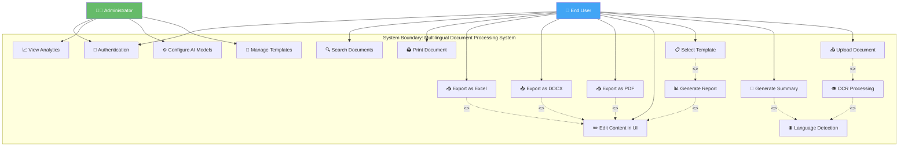

# 3. Use Case Diagram

## Mermaid Files

| File | Description |
|------|-------------|
| [use_case.mmd](use_case.mmd) | Full Use Case Diagram with actors & relationships |

> Open `.mmd` files in [Mermaid Live Editor](https://mermaid.live), VS Code with Mermaid extension, or any Mermaid-compatible tool.

---

## What is a Use Case Diagram?

A **Use Case Diagram** is a UML (Unified Modeling Language) diagram that shows the **interactions between users (actors) and the system**. It captures **what the system does** from the user's perspective, not how it does it.

## Why Use It?

- Identifies all **system functionalities** from user perspective
- Defines **actors** (who uses the system)
- Shows **relationships** between use cases (include, extend)
- Essential for **requirements gathering**
- Commonly required in **academic project reports**

## When to Use

- During **requirements analysis phase**
- When defining **system scope and boundaries**
- For **stakeholder communication**
- In **SRS (Software Requirements Specification)**

---

## Main Use Case Diagram

---

## Detailed Use Case Descriptions

### UC-01: Upload Document
| Field | Description |
|-------|-------------|
| **Use Case ID** | UC-01 |
| **Name** | Upload Document |
| **Actor** | End User |
| **Precondition** | User is logged in |
| **Main Flow** | 1. User selects file (PDF/Image/DOCX/TXT) → 2. System validates file type → 3. System stores file → 4. System triggers OCR if needed → 5. System confirms upload |
| **Postcondition** | Document is stored and text is extracted |
| **Includes** | UC-02 (OCR Processing) |

### UC-04: Generate Summary
| Field | Description |
|-------|-------------|
| **Use Case ID** | UC-04 |
| **Name** | Generate Summary |
| **Actor** | End User |
| **Precondition** | Document is uploaded and processed |
| **Main Flow** | 1. User selects document → 2. User clicks "Summarize" → 3. System processes via RAG + Mistral → 4. System returns summary in simple language |
| **Postcondition** | Summary is displayed in UI |
| **Includes** | UC-03 (Language Detection) |

### UC-05: Select Template
| Field | Description |
|-------|-------------|
| **Use Case ID** | UC-05 |
| **Name** | Select Template |
| **Actor** | End User |
| **Precondition** | User is logged in |
| **Main Flow** | 1. User browses template cards → 2. User selects a template (e.g., Affidavit, Meeting Minutes) → 3. System loads template → 4. System pre-fills with document data |
| **Postcondition** | Template is loaded with data |
| **Includes** | UC-06 (Generate Report) |

### UC-07: Edit Content in UI
| Field | Description |
|-------|-------------|
| **Use Case ID** | UC-07 |
| **Name** | Edit Content in UI |
| **Actor** | End User |
| **Precondition** | Report or summary is generated |
| **Main Flow** | 1. User views generated content → 2. User makes manual edits → 3. System saves changes → 4. User previews final version |
| **Postcondition** | Content is finalized and ready for export |
| **Extended by** | UC-08, UC-09, UC-10 (Export options) |

---

## Actor Descriptions

| Actor | Type | Description |
|-------|------|-------------|
| **End User** | Primary | Government officials, office workers who upload documents and generate reports |
| **Administrator** | Primary | System admin who manages templates and AI model configurations |
| **Ollama/Mistral** | Secondary (System) | AI backend that processes summarization and generation requests |
| **Vector Database** | Secondary (System) | Storage system for document embeddings |

---

## Use Case Relationships

| Relationship | Symbol | Meaning | Example |
|-------------|--------|---------|---------|
| **Include** | `<<include>>` | Required sub-behavior | Upload always includes OCR |
| **Extend** | `<<extend>>` | Optional behavior | Export extends editing |
| **Generalization** | Arrow | Specialized actor/use case | Export → PDF/DOCX/Excel |
