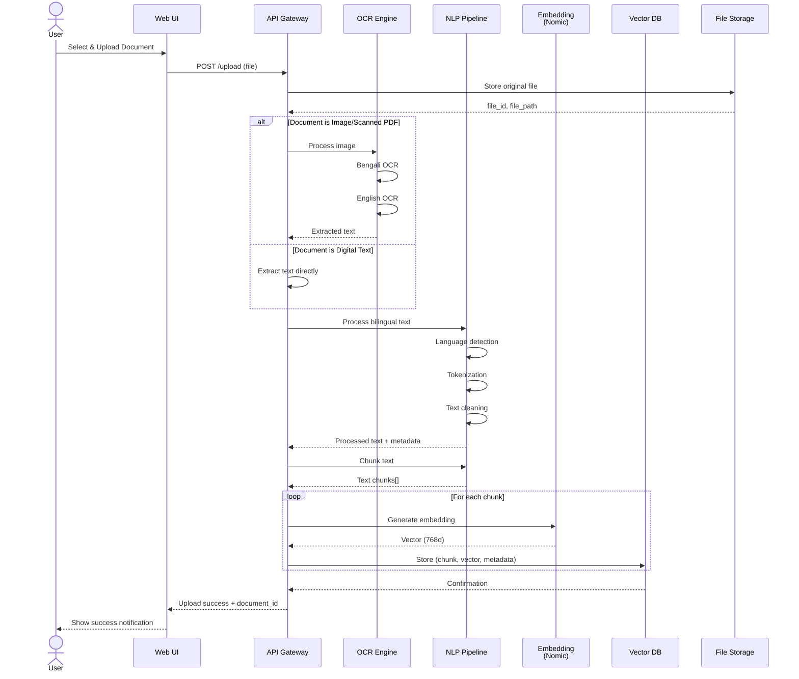
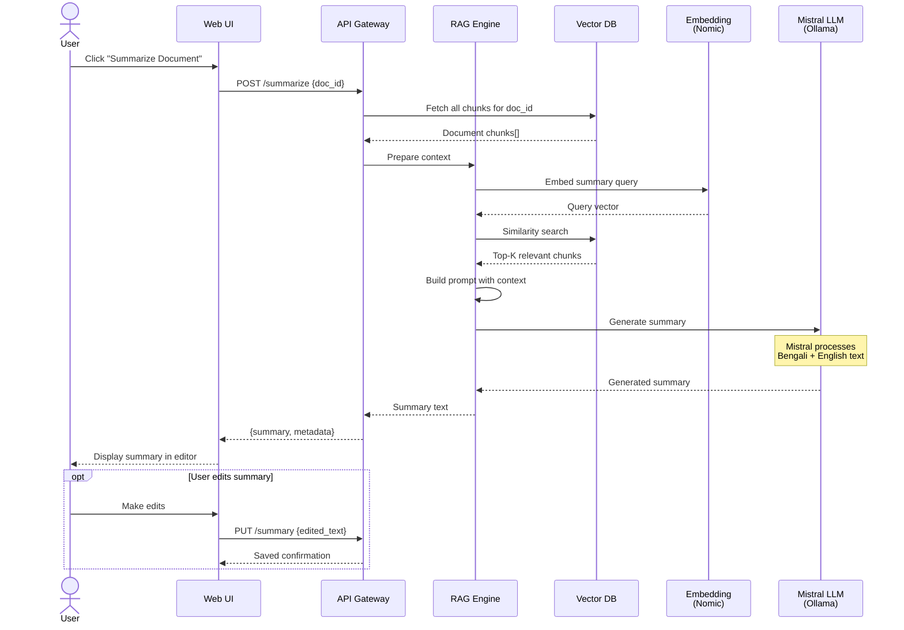
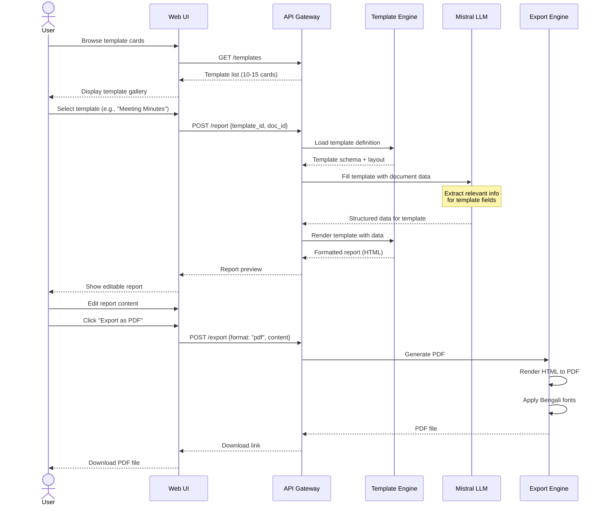
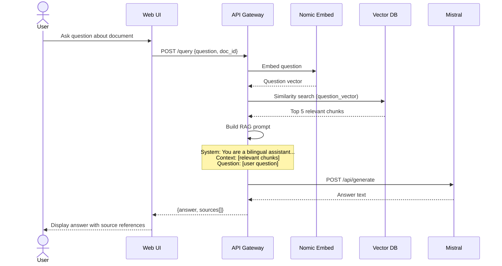

# 4. Sequence Diagram

## Mermaid Files

| File | Description |
|------|-------------|
| [seq_document_upload.mmd](seq_document_upload.mmd) | Document Upload & Processing flow |
| [seq_summarization.mmd](seq_summarization.mmd) | Document Summarization flow |
| [seq_template_report.mmd](seq_template_report.mmd) | Template-Based Report Generation & Export |
| [seq_rag_query.mmd](seq_rag_query.mmd) | RAG Query (Question Answering) |

> Open `.mmd` files in [Mermaid Live Editor](https://mermaid.live), VS Code with Mermaid extension, or any Mermaid-compatible tool.

---

## What is a Sequence Diagram?

A **Sequence Diagram** shows the **time-ordered interactions** between objects/components in the system. It illustrates the **message flow** between actors and system components for specific use cases, making it clear **who communicates with whom and in what order**.

## Why Use It?

- Shows **detailed message flow** between components
- Captures **timing and order** of operations
- Identifies **all interactions** for a specific scenario
- Helps in **API design** and **interface planning**
- Excellent for **documenting complex workflows**

## When to Use

- During **detailed design phase**
- When documenting **API interactions**
- For **complex multi-component workflows**
- When explaining **system behavior** to developers

---

## Sequence 1: Document Upload & Processing

---

## Sequence 2: Document Summarization

---

## Sequence 3: Template-Based Report Generation & Export

---

## Sequence 4: RAG Query (Question Answering)

---

## Key Observations

| Aspect | Detail |
|--------|--------|
| **Async Operations** | Embedding generation for chunks happens in a loop |
| **Conditional Flow** | OCR is only used for scanned/image documents |
| **Optional Steps** | User editing is optional before export |
| **Local Processing** | All AI calls go to local Ollama instance (no external API) |
| **Multi-format** | Same workflow supports PDF, DOCX, and Excel export |
