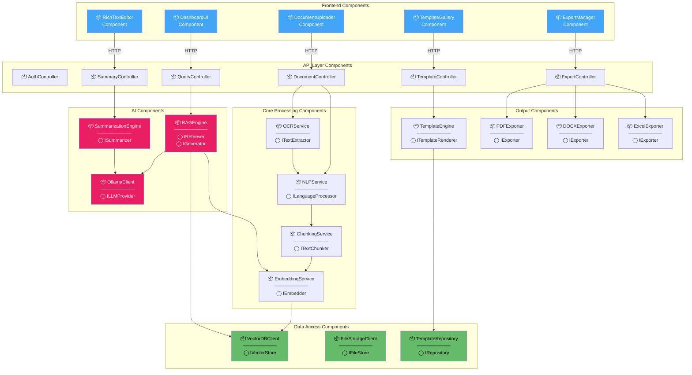

# 6. Component Diagram

## Mermaid Files

| File | Description |
|------|-------------|
| [component_diagram.mmd](component_diagram.mmd) | Full System Component Diagram with interfaces |

> Open `.mmd` files in [Mermaid Live Editor](https://mermaid.live), VS Code with Mermaid extension, or any Mermaid-compatible tool.

---

## What is a Component Diagram?

A **Component Diagram** is a UML structural diagram that shows the **software components**, their **interfaces**, and the **dependencies** between them. It focuses on the **physical organization** of code — packages, libraries, modules, and how they connect through well-defined interfaces.

## Why Use It?

- Shows **modular structure** of the software
- Defines **interfaces** between components
- Illustrates **dependencies** and **coupling**
- Helps in **system decomposition** and **team assignment**
- Essential for **software architecture documentation**

## When to Use

- During **system design** and **modular planning**
- When planning **microservices** or **modules**
- For **dependency analysis**
- When assigning work to **development teams**

---

## Full System Component Diagram



---

## Interface Definitions

| Interface | Component | Methods |
|-----------|-----------|---------|
| `ITextExtractor` | OCRService | `extract_text(file) → str` |
| `ILanguageProcessor` | NLPService | `detect_language(text) → lang`, `process(text) → tokens` |
| `ITextChunker` | ChunkingService | `chunk(text, size) → chunks[]` |
| `IEmbedder` | EmbeddingService | `embed(text) → vector[768]` |
| `IRetriever` | RAGEngine | `retrieve(query, top_k) → chunks[]` |
| `IGenerator` | RAGEngine | `generate(prompt, context) → str` |
| `ILLMProvider` | OllamaClient | `generate(model, prompt) → str` |
| `ISummarizer` | SummarizationEngine | `summarize(document) → str` |
| `ITemplateRenderer` | TemplateEngine | `render(template_id, data) → html` |
| `IExporter` | PDF/DOCX/ExcelExporter | `export(content, format) → file` |
| `IVectorStore` | VectorDBClient | `store(vector, metadata)`, `search(vector) → results[]` |
| `IFileStore` | FileStorageClient | `save(file) → path`, `load(path) → file` |
| `IRepository` | TemplateRepository | `get(id) → template`, `list() → templates[]` |

---

## Component Dependencies Matrix

| Component | Depends On |
|-----------|-----------|
| DocumentUploader | AuthController, DocumentController |
| OCRService | Tesseract/EasyOCR (external lib) |
| NLPService | spaCy, NLTK (external libs) |
| EmbeddingService | OllamaClient (Nomic Embed) |
| RAGEngine | EmbeddingService, VectorDBClient, OllamaClient |
| SummarizationEngine | OllamaClient (Mistral) |
| TemplateEngine | TemplateRepository, Jinja2 |
| PDFExporter | ReportLab/WeasyPrint (external lib) |
| DOCXExporter | python-docx (external lib) |
| ExcelExporter | openpyxl (external lib) |

---

## Package Structure

```
rag_project/
├── frontend/                  # Frontend Components
│   ├── components/
│   │   ├── DocumentUploader/
│   │   ├── TemplateGallery/
│   │   ├── RichTextEditor/
│   │   └── ExportManager/
│   └── pages/
├── backend/                   # API + Core Components
│   ├── api/
│   │   ├── auth_controller.py
│   │   ├── document_controller.py
│   │   ├── summary_controller.py
│   │   ├── template_controller.py
│   │   └── export_controller.py
│   ├── services/
│   │   ├── ocr_service.py
│   │   ├── nlp_service.py
│   │   ├── chunking_service.py
│   │   ├── embedding_service.py
│   │   ├── rag_engine.py
│   │   ├── summarization_engine.py
│   │   └── template_engine.py
│   ├── exporters/
│   │   ├── pdf_exporter.py
│   │   ├── docx_exporter.py
│   │   └── excel_exporter.py
│   └── data/
│       ├── vector_db_client.py
│       ├── file_storage_client.py
│       └── template_repository.py
└── templates/                 # Template Definitions
    └── cards/
```
