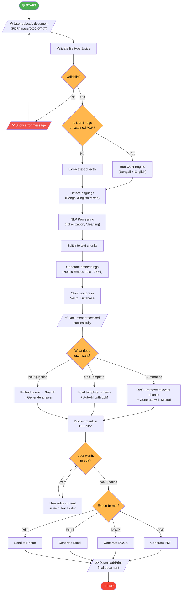
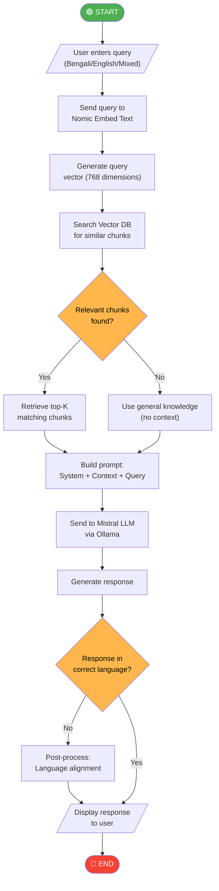
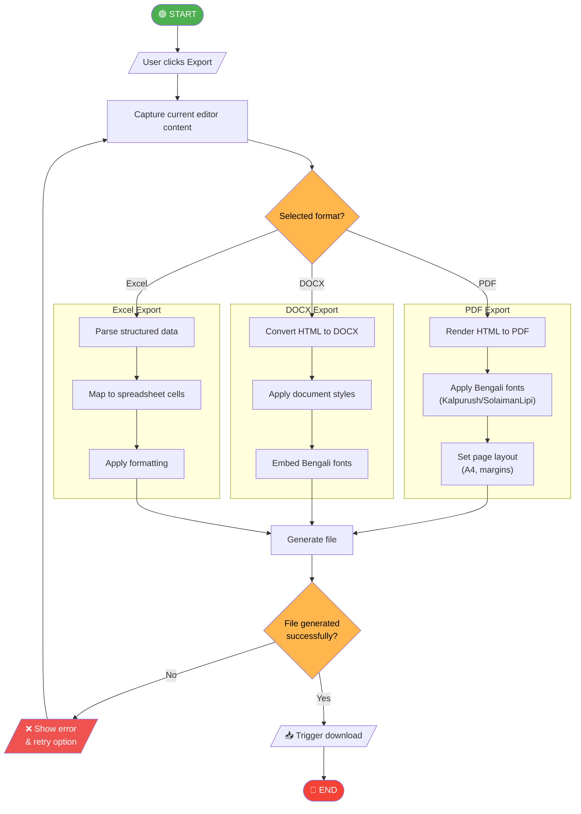

# 9. Flowchart Diagram

## Mermaid Files

| File | Description |
|------|-------------|
| [flowchart_main_process.mmd](flowchart_main_process.mmd) | Main System Process Flow |
| [flowchart_rag_process.mmd](flowchart_rag_process.mmd) | RAG (Retrieval Augmented Generation) Process |
| [flowchart_export_process.mmd](flowchart_export_process.mmd) | Export Process Flow |

> Open `.mmd` files in [Mermaid Live Editor](https://mermaid.live), VS Code with Mermaid extension, or any Mermaid-compatible tool.

---

## What is a Flowchart?

A **Flowchart** is the most fundamental and widely understood diagram type. It shows the **step-by-step process** with clear **decision points** (Yes/No branches), **input/output** operations, and **process blocks**. Unlike activity diagrams, flowcharts are simpler and more universally recognized.

## Why Use It?

- **Simplest** and most universally understood diagram
- Shows **step-by-step logic** with decisions
- Great for **algorithm representation**
- Easy for **non-technical stakeholders** to understand
- Required in almost **every academic project**

## When to Use

- When explaining **algorithms** or **business logic**
- For **process documentation**
- In **user manuals** and **help guides**
- When presenting to **non-technical audiences**
- In **viva/defense presentations**

---

## Flowchart 1: Main System Process Flow

---

## Flowchart 2: RAG (Retrieval Augmented Generation) Process

---

## Flowchart 3: Export Process

---

## Flowchart Symbols Reference

| Symbol | Shape | Meaning | Example |
|--------|-------|---------|---------|
| ⬭ | Rounded Rectangle / Stadium | Start/End | START, END |
| ▭ | Rectangle | Process | "Run OCR Engine" |
| ◇ | Diamond | Decision | "Valid file?" |
| ▱ | Parallelogram | Input/Output | "User uploads file" |
| → | Arrow | Flow direction | Sequential step |
