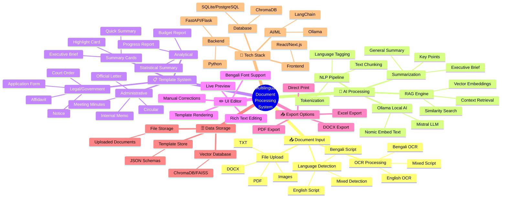
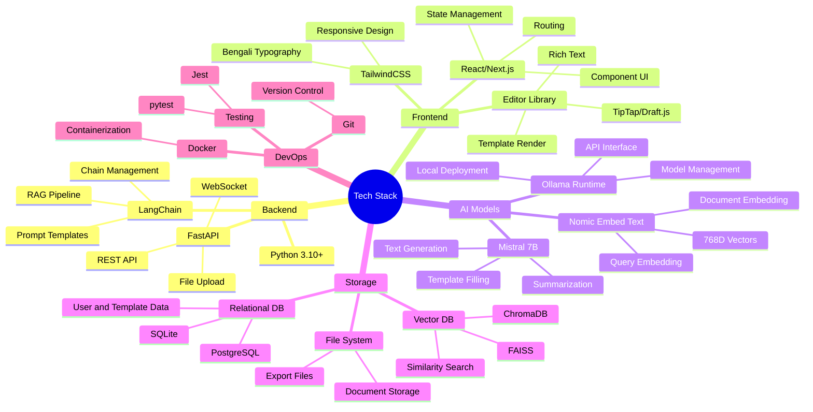
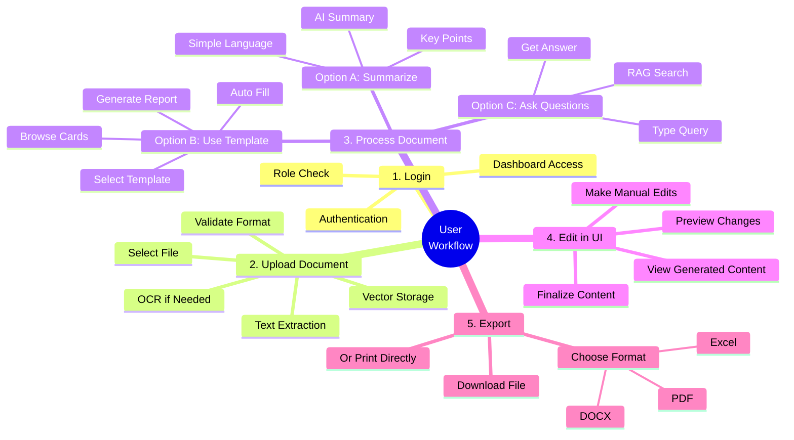
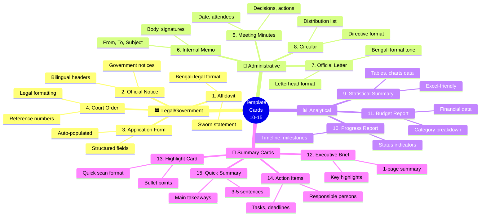

# 10. Mind Map Diagram

## Mermaid Files

| File | Description |
|------|-------------|
| [mindmap_project_overview.mmd](mindmap_project_overview.mmd) | Complete Project Overview |
| [mindmap_tech_stack.mmd](mindmap_tech_stack.mmd) | Technology Stack Breakdown |
| [mindmap_user_workflow.mmd](mindmap_user_workflow.mmd) | User Workflow Steps |
| [mindmap_template_categories.mmd](mindmap_template_categories.mmd) | Template Categories Detail |

> Open `.mmd` files in [Mermaid Live Editor](https://mermaid.live), VS Code with Mermaid extension, or any Mermaid-compatible tool.

---

## What is a Mind Map?

A **Mind Map** is a visual diagram that organizes information around a **central concept**, branching out into related topics, subtopics, and details. It provides a **bird's-eye view** of the entire project scope and helps in **brainstorming**, **planning**, and **presenting project overview**.

## Why Use It?

- Provides a **holistic view** of the entire project
- Great for **brainstorming** and **ideation**
- Easy to understand at a **glance**
- Helps in **project scoping** and **feature planning**
- Excellent for **presentations and viva defense**

## When to Use

- At **project inception** for brainstorming
- During **project presentations**
- For **feature planning** and **requirement mapping**
- When giving a **quick overview** to stakeholders
- In **viva/defense** as an opening slide

---

## Mind Map 1: Complete Project Overview

---

## Mind Map 2: Technology Stack Breakdown

---

## Mind Map 3: User Workflow

---

## Mind Map 4: Template Categories Detail

---

## How to Create Mind Maps

| Tool | Type | Best For |
|------|------|----------|
| **Mermaid.js** | Code-based | Documentation, version control |
| **XMind** | Desktop app | Detailed brainstorming |
| **MindMeister** | Online tool | Collaborative planning |
| **draw.io** | Free online | Custom styling |
| **Whimsical** | Online tool | Beautiful presentations |

---

## Tips for Project Presentations

1. **Start with Mind Map**: Give the big picture first
2. **Then Architecture**: Show technical structure
3. **Then DFD**: Show data flow
4. **Then Use Case**: Show user interactions
5. **Then Sequence/Activity**: Show detailed workflows
6. **End with ER Diagram**: Show data model
